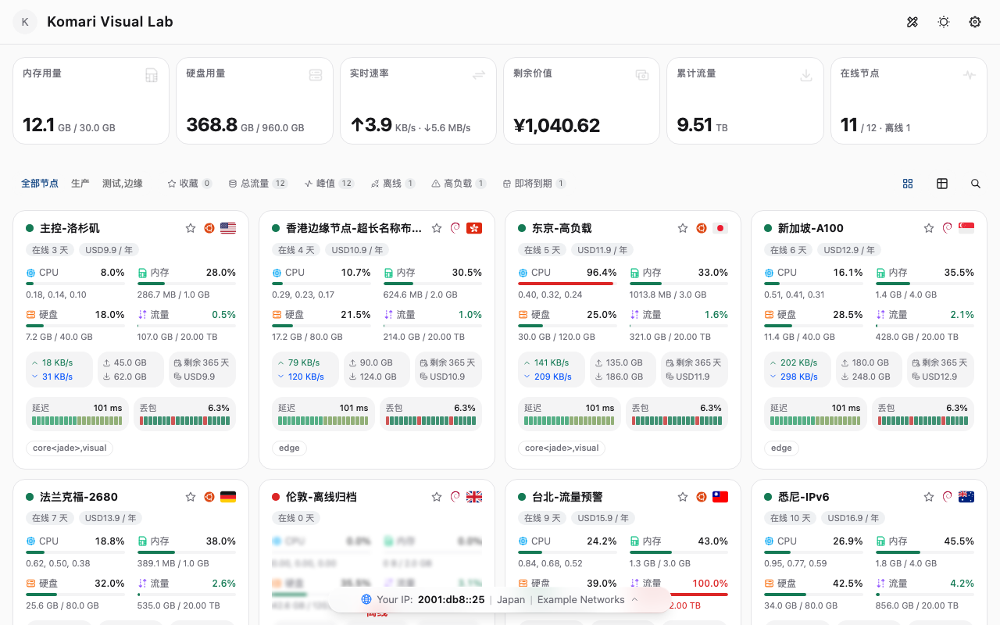

<div align="center">

# ink

**Komari Monitor 主题 · 深蓝灵动 · 极简克制**

一个为 [Komari Monitor](https://github.com/elevenhq/komari-monitor) 打造的现代化监控主题：**slate 中性基调 + 深蓝点睛 + 非纯黑暗色**，以 shadcn/ui 设计语言重构的高密度运维仪表盘。

[](https://github.com/jacob-bytes/komari-theme-ink/releases)
[](LICENSE)
[](https://vuejs.org)
[](https://tailwindcss.com)
[](https://bun.sh)

</div>

---

## ✨ 特性

- **深蓝灵动（非纯黑）暗色模式** —— `oklch(0.14 0.022 265)` 蓝紫底 / 亮色 `#f8fafc` slate 冷灰，双模式完整适配
- **3 语义色收敛** —— 蓝（primary：图表/选中/hover）· 绿（success：仅在线状态）· 红（danger：仅异常/丢包），无紫橙青绿噪音
- **精密仪表盘视觉** —— 全站等宽数字（`font-mono tabular-nums`）+ 极细网格 + 1.5px 蓝色折线
- **动态状态表达** —— 进度条 0-60 中性灰 / 60-85 琥珀 / 85+ 红；延迟/丢包**蓝系色阶条形**（真异常才红）
- **信息层级克制** —— 总览卡固高无抖动、辅助信息行、筛选栏仅展示异常统计（减法设计）
- **响应式** —— 移动端单列/2 列自适应，触控 ≥44px
- **无障碍** —— 键盘焦点环、状态色 + 形状双重表达、色觉友好模式保留全彩

> **注意**：ink 是 **Komari 主题包**（zip 导入产物），不是独立 Web 应用——**Vercel 等平台的线上部署不适用**；发布与分发以 **GitHub Releases 的 `ink-build-*.zip`** 为准。

## 🚀 快速开始

### 方式一：直接使用

1. 从 [Releases](https://github.com/jacob-bytes/komari-theme-ink/releases) 下载 `ink-build-*.zip`
2. Komari 后台 → 主题 → **导入主题**
3. 切换主题为 **ink**，即可享受深蓝仪表盘

### 方式二：本地构建

```bash
bun install
bun run build        # 产出 dist/ + ink-build-<sha>.zip
bun run dev          # 本地开发预览
```

## 🖼️ 预览



## 🧱 技术栈

| 层 | 技术 |
|---|---|
| 框架 | Vue 3.5 + Vite 7 |
| 样式 | Tailwind CSS v4 + CSS Variables（oklch token） |
| 组件 | reka-ui / shadcn 风格组件（Card/Button/Tabs/Badge/Tooltip…） |
| 图表 | vue-echarts（ECharts 6，按需树摇） |
| 状态 | Pinia |
| 语言 | TypeScript |
| 构建 | Bun |

## 🏗️ 架构

```text
Component → Composable → Service → RequestManager / CacheService → API / RPC
```

- **业务层**：复用 [komari-theme-blueprint](https://github.com/jacob-bytes/komari-theme-blueprint) 的成熟数据/服务栈（stores、auth、history、provider 等）
- **UI 层**：ink 独立重构（深蓝仪表盘设计语言）
- **契约**：`komari-theme.json`（版本唯一来源）+ `docs/preview.png` + `dist/` 打包

## 🎨 设计 Token（3 语义色）

| Token | 值 | 用途 |
|---|---|---|
| `--primary` | `oklch(0.55 0.16 258)` | 图表主线 / 选中态 / hover 边框 / sparkline |
| `--success` | `oklch(0.62 0.13 154)` | **仅**在线/正常状态点 |
| `--danger` | `oklch(0.58 0.18 25)` | **仅**异常 / 丢包 / 85%+ 负载 |
| `--warning` | `oklch(0.72 0.14 70)` | 60-85% 负载 / 延迟中间档 |

> 中性色（background/card/border/muted）为灰阶层，不参与语义。

## ⚙️ 后台配置（46 项）

主题设置 / 数据刷新 / 告警 / 价格展示 / 快捷控制与阈值 / 详情卡片 / 图表模板 / 背景——全部经 `komari-theme.json` 注册，可在 Komari 后台自定义。

## 📚 致谢

- 设计语言灵感：[shadcn/ui](https://github.com/shadcn-ui/ui)（样式致敬，非代码搬运）
- 上游数据与场景：[Komari Monitor](https://github.com/elevenhq/komari-monitor)
- 业务层基础：[komari-theme-blueprint](https://github.com/jacob-bytes/komari-theme-blueprint)

## 📄 许可

MIT —— 详见 [LICENSE](LICENSE)。欢迎 Star / Issue / PR 共建。

---

<div align="center">
<p><b>ink</b> — 深蓝灵动 · 克制高级 · 精密仪表盘</p>
</div>
